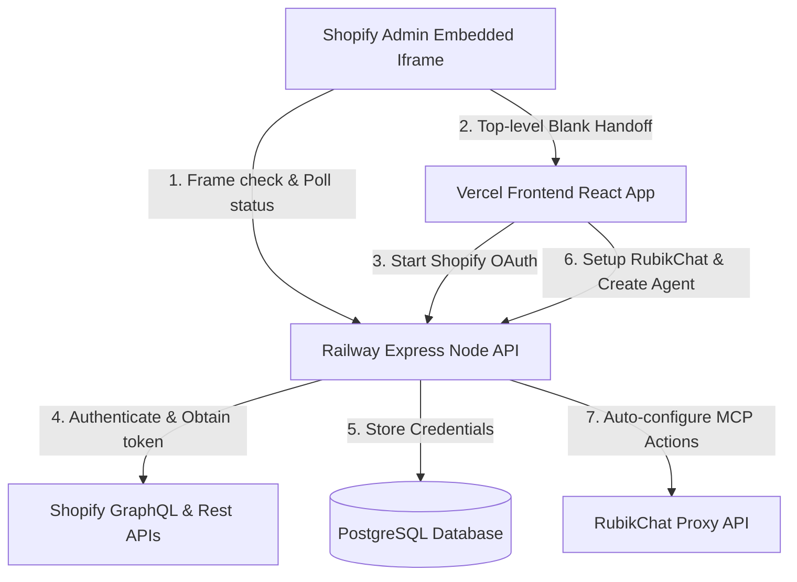

# Shopify Integration & OAuth Handoff Architecture

This document details the architecture, UI flow, iframe handoff mechanisms, API endpoints, database schemas, and configuration settings for the RubikChat Shopify Integration.

---

## 1. Architectural Overview & Services



### Services Directory

1. **Railway Express Backend**
   - **Host URL**: `https://rubik-chat-lead-gen-node-server-backend-production-0f28.up.railway.app`
   - **Port Binding**: Runs on `PORT=3000` (mapped to Railway Public Networking on port 8080/3000).
   - **Database**: PostgreSQL accessed via Prisma Client.
   - **Database Tables**:
     - `shopify_integrations`: Stores `store_url`, `access_token`, `store_name`, `rubik_user_id`, `rubik_organization_id`, `rubik_organization_slug`, `rubik_agent_id`, `status` (`connected`, `widget_enabled`), and script tags configurations.
     - `rubikchat_organizations`: Stores RubikChat login credentials (`email`, `password`, `token`) linked to a `store_url`.
     - `rubikchat_agents`: Keeps tracks of `organization_id` and registered `agent_id` instances.
     - `api_logs`: Tracks execution details for critical setup stages.

2. **Vercel React Frontend**
   - **Host URL**: `https://shopify-o-auth-with-rubik-node-app.vercel.app`
   - **Environment Variable**: `VITE_BACKEND_URL=https://rubik-chat-lead-gen-node-server-backend-production-0f28.up.railway.app`
   - **Responsibilities**: Handles onboarding screens, email input, agent creation status UI, and embedding the widget.

3. **Shopify Partner App Configuration**
   - **App Handle**: `rubikchat-agent-app-1`
   - **Client ID**: `313c24ef02b06cd1f27c138c25f6a4a2`
   - **Embedded Setting**: `embedded = true` (configured to run within Shopify Admin dashboard iframe).

---

## 2. End-to-End Authentication & Handoff Pipeline

### Phase 1: Embedded Iframe Check & Top-Level Handoff
1. **Initial Access**: When a merchant clicks on the RubikChat app inside Shopify Admin, Shopify loads an embedded `<iframe>` pointing to:
   `GET https://rubik-chat-lead-gen-node-server-backend-production-0f28.up.railway.app/?shop={shop_domain}&host={host}&embedded=1`
2. **CSP Framing Rules**: The Express server sets Helmet CSP headers dynamically to avoid frameblocking:
   `Content-Security-Policy: frame-ancestors https://admin.shopify.com https://*.myshopify.com;`
3. **Connection State Verification**:
   - The Express backend queries `prisma.shopify_integrations` for the provided `shop` parameter.
   - If **unconnected**, the server renders a setup page containing a **"Connect with RubikChat"** button.
   - If **connected**, it renders the dashboard state showing the connection status and toggle switches.
4. **OAuth Tab Escape (`_blank` handoff)**:
   - To bypass framing security blocks on top-level navigations (`admin.shopify.com` rejecting OAuth redirects), the connect button opens a new tab:
     `window.open('https://shopify-o-auth-with-rubik-node-app.vercel.app/?shop=' + shop + '&host=' + host + '&embedded=0', '_blank');`
   - Simultaneously, the embedded iframe launches a 3-second polling interval requesting `GET /api/status?shop={shop_domain}` to listen for connection updates.

---

### Phase 2: Shopify OAuth Process
1. **Initiate OAuth Redirect**:
   - The Vercel frontend tab redirects the user to:
     `GET /api/auth/shopify?shop={shop_domain}`
   - The Express backend builds the authorization redirect URL:
     `https://{shop_domain}/admin/oauth/authorize?client_id=313c24ef02b06cd1f27c138c25f6a4a2&scope=read_products,write_products,write_script_tags,read_script_tags,read_orders&redirect_uri=https://rubik-chat-lead-gen-node-server-backend-production-0f28.up.railway.app/api/auth/shopify/callback`
2. **Authorize Permissions**: The merchant reviews permissions in Shopify Admin and authorizes.
3. **Callback Processing**:
   - Shopify redirects back to `/api/auth/shopify/callback` with `code`, `hmac`, `shop`, `timestamp`, and `state`.
   - The Express backend validates the HMAC signature to ensure authenticity.
   - Exchages the temporary authorization `code` for a permanent offline access token:
     `POST https://{shop_domain}/admin/oauth/access_token`
   - Queries store name and saves metadata to `prisma.shopify_integrations`:
     ```typescript
     await prisma.shopify_integrations.upsert({
       where: { store_url: shop },
       update: { access_token: accessToken, status: 'connected', store_name: shopName },
       create: { store_url: shop, access_token: accessToken, status: 'connected', store_name: shopName }
     });
     ```
   - Redirects the browser back to Vercel's setup status page.

---

### Phase 3: RubikChat Account Creation & Login
Once Shopify is connected, the Vercel frontend prompts the merchant to enter their email address to set up RubikChat:

1. **Auto Onboarding (`POST /api/rubikchat/setup`)**:
   - The Vercel frontend triggers this endpoint with `{ shop, email }`.
   - **Registration**: The Express backend generates a random secure password and posts a registration request to RubikChat Proxy:
     `POST https://api-proxy-v1.rubikchat.com/api/wps/register`
     - Form Fields: `email`, `password`, `domain` (`store_url`), `company_name` (`store_name`).
     - Extracted IDs: `user_id`, `organization_id`, `organization_slug` (saved to the `shopify_integrations` record).
     - *If email is already registered, registration is skipped.*
   - **Login & Authentication**: The Express backend logs the user in to get an active authentication token:
     `POST https://api-proxy-v1.rubikchat.com/api/login`
     - Form Fields: `email`, `password`.
     - Returns `token` (saved to `prisma.rubikchat_organizations` alongside credentials).

---

### Phase 4: Agent Creation & Automatic MCP Setup
Once the RubikChat organization session is active, the agent creation is triggered:

1. **Agent Setup (`POST /api/rubikchat/create-agent`)**:
   - Frontend triggers this endpoint with `{ shop }`.
   - The Express backend prepares a multi-part form to train the chatbot:
     `POST https://api-proxy-v1.rubikchat.com/api/chatbots/train-chatbot/{organizationIdentifier}`
     - Headers: `Authorization: Bearer {token}`
     - Form Fields:
       - `user_id`, `organization_id`
       - `agentType: "website"`
       - `website`: `[{"url": "https://{shop_domain}", "content": "this is a Shopify Store"}]`
       - `instructions`: System directives ensuring appropriate language, tone, grounding rules, and confirmation guidelines.
       - `botName`: `{formattedShopName} Assistant`
   - On successful creation, retrieves `agentId` (bot key), updates status to `widget_enabled`, and records details in `rubikchat_agents`.

2. **Automated MCP Configurator (`setupShopifyMcpForAgent`)**:
   - Immediately following agent creation, the backend invokes the MCP auto-setup service:
     `POST https://api-proxy-v1.rubikchat.com/api/organizations/{organizationSlug}/mcp-apis`
     - Registers the collection `shopify_actions` (saves `mcp_api_id` to database).
   - Iterates and registers **3 core Shopify Actions** via:
     `POST https://api-proxy-v1.rubikchat.com/api/save-mcp-api-configs`

---

## 3. Registered MCP Tools & Schemas

### 1. Get Shopify Products (`get_products`)
- **Method / Endpoint**: `POST /api/shopify/products`
- **JSON Input Schema**:
  ```json
  {
    "type": "object",
    "properties": {
      "shop": { "type": "string", "default": "{storeUrl}" }
    },
    "required": ["shop"]
  }
  ```
- **JSON Response Schema**:
  ```json
  {
    "type": "object",
    "properties": {
      "products": {
        "type": "array",
        "items": {
          "type": "object",
          "required": ["title", "price", "image_url", "variants"],
          "properties": {
            "title": { "type": "string" },
            "price": { "type": "string" },
            "image_url": { "type": "string" },
            "variants": {
              "type": "array",
              "items": {
                "type": "object",
                "properties": {
                  "title": { "type": "string", "description": "e.g., $10, $25, $50, $100" },
                  "price": { "type": "string" },
                  "variant_id": { "type": "string" }
                }
              }
            }
          }
        }
      }
    }
  }
  ```
- **Agent Instruction Description**:
  ```
  CRITICAL ACTION: Call this tool when a user asks about available products, store catalog items, pricing, or product variants/options (e.g., sizes, colors, gift card denominations).

  MANDATORY CATALOG & VARIANT DISPLAY RULES:

  Catalog Overview Requests ("Show all items" / "List products"):
  - You MUST iterate through ALL products returned in the catalog payload.
  - For every product, inspect its variants array.
  - If a product has multiple variants (e.g., Gift Card denominations, T-Shirt sizes, colors), list ALL available variant options and their prices beneath that product title.
  - If a product has only 1 variant named "Default Title", simply display the main product price.

  Single Product / Variant Requests:
  - If the user asks about a specific product or its variants (e.g., "any variants in Gift Card?"), list EVERY single variant option in the variants array with its price.
  - Never default to showing only the first item in the variants array.
  - Never state "I don't have variant information" if variants exist in the payload.

  REQUIRED RESPONSE FORMAT:
  [Product Title 1]
  Price: [Base Price]

  Available Options:
  [Variant Title 1] — [Price 1]
  [Variant Title 2] — [Price 2]
  [Variant Title 3] — [Price 3]

  [Product Title 2]
  Price: [Base Price] (If only 1 default variant exists, omit the list below)
  ```

---

### 2. Create Shopify Cart and Checkout URL (`create_cart`)
- **Method / Endpoint**: `POST /api/shopify/cart`
- **JSON Input Schema**:
  ```json
  {
    "type": "object",
    "required": ["shop", "items"],
    "properties": {
      "shop": { "type": "string" },
      "items": {
        "type": "array",
        "items": {
          "type": "object",
          "required": ["product_name", "variant_title", "quantity"],
          "properties": {
            "product_name": {
              "type": "string",
              "description": "Base product title (e.g., 'Gift Card')."
            },
            "variant_title": {
              "type": "string",
              "description": "MANDATORY for multi-option products. Pass the option name/denomination chosen by the user (e.g. '$100', '$50', '$25', '$10', 'Large', 'Red')."
            },
            "quantity": { "type": "number" }
          }
        }
      }
    }
  }
  ```
- **Agent Instruction Description**:
  ```
  CRITICAL ACTION: Generates a Shopify checkout permalink.

  PARAMETER REQUIREMENTS:
  product_name: Pass ONLY the main product title (e.g., "Gift Card" or "Selling Plans Ski Wax").
  variant_title: MANDATORY for products with options. You MUST pass the specific variant choice selected by the user (e.g., "$25", "$50", "$100", "Special Selling Plans Ski Wax", "Ice").
  quantity: The number of items requested (default: 1).

  STRICT EXAMPLES:
  User asks for $50 Gift Card:
  items: [{"product_name": "Gift Card", "variant_title": "$50", "quantity": 1}]

  User asks for 3 of the $100 Gift Card:
  items: [{"product_name": "Gift Card", "variant_title": "$100", "quantity": 3}]

  FORBIDDEN: Never send {"product_name": "Gift Card"} without variant_title when options ($10, $25, $50, $100) exist.
  ```

---

### 3. Get Order Status and Details (`get_order_status`)
- **Method / Endpoint**: `POST /api/shopify/order-status`
- **JSON Input Schema**:
  ```json
  {
    "type": "object",
    "properties": {
      "shop": { "type": "string", "default": "{storeUrl}" },
      "order_number": {
        "type": "string",
        "description": "Order number or name (e.g., #1001 or 1001)"
      }
    },
    "required": ["shop", "order_number"]
  }
  ```
- **Agent Instruction Description**:
  ```
  CRITICAL ACTION: Used to look up order tracking, status, fulfillment state, and line items using an order number or customer email.
  ```

---

## 4. Backend Resolution & Matching Logic (Safety Net)

The Express backend handles matching dynamically to ensure errors in the LLM payloads (such as omitting elements) do not produce invalid checkout permalinks.

1. **GraphQL Query Fetching**: When resolving products, the backend queries up to 250 variants per item (`variants(first: 250) { edges { node { id title price } } }`) to have full variant visibility.
2. **Variant Validation**:
   - If the incoming item includes a `variant_id`, the backend validates it against the fetched product's actual variants.
   - If the ID does not belong to the product, it is ignored and matching falls back to titles.
3. **Fuzzy & Case-Insensitive Matching**:
   - Normalizes text by removing symbols (like `$` and spaces).
   - First looks for an exact normalized match (`"25" === "25"`).
   - If missing, checks substring presence (`vNorm.includes(searchNorm)`).
4. **Digit-Extraction Matching**:
   - If fuzzy matching fails, a regex parses trailing or parenthetical digits (e.g., matching `"100"` from `"$100"`, `"100 USD"`, or `"Gift Card $100"`).
   - Matches the extracted digits against variant titles containing those digits.
5. **Safe Fallback**: If all match methods fail, it defaults to the first variant (`variants[0]`) to ensure the user gets a functional link.
